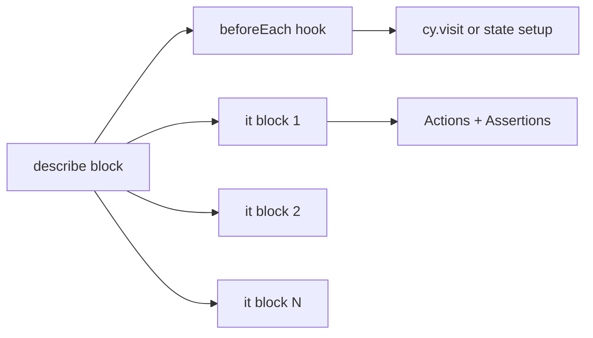

# Design Document: Cypress Test Suite

## Overview

This design describes the technical architecture for a Cypress E2E test suite that serves as a teaching tool for students learning the Cypress study guide (`docs/cypress.md`). The suite exercises a Pokedex Angular 20 application covering login flows, route guard protection, Pokemon search with async rendering, direct API testing, accessibility auditing, and visual regression testing.

The test suite is isolated in its own `cypress/` directory structure at the project root, configured via `cypress.config.ts`, and integrated with npm scripts for both interactive and headless execution modes.

### Design Decisions

| Decision | Rationale |
|----------|-----------|
| TypeScript for all Cypress files | Matches the Angular project's language and provides type safety for custom commands |
| Custom Commands over Page Objects | Aligns with Cypress best practices and the study guide's "Architectural Patterns" section |
| `data-cy` attributes over CSS selectors | Decouples tests from styling changes; recommended "Gold Standard" per study guide |
| Single `cypress/` directory at root | Enables future Playwright coexistence without path conflicts |
| Plugin registration in `setupNodeEvents` | Standard Cypress 12+ pattern for both `cypress-image-snapshot` and other node-level plugins |

---

## Architecture

The Cypress test suite integrates as a development-time testing layer alongside the existing Angular application. It operates against the running dev server at `http://localhost:4200`.

```mermaid
graph TB
    subgraph "Developer Workflow"
        A[npm run cy:open] --> B[Cypress Test Runner GUI]
        C[npm run cy:run] --> D[Cypress Headless CLI]
    end

    subgraph "Cypress Infrastructure"
        B --> E[cypress.config.ts]
        D --> E
        E --> F[cypress/support/e2e.ts]
        F --> G[cypress/support/commands.ts]
        F --> H[cypress-axe import]
        F --> I[image-snapshot command import]
    end

    subgraph "Test Specs (cypress/e2e/)"
        J[login.cy.ts]
        K[data-driven-login.cy.ts]
        L[api.cy.ts]
        M[route-guard.cy.ts]
        N[pokemon-search.cy.ts]
        O[accessibility.cy.ts]
        P[visual-regression.cy.ts]
    end

    subgraph "Angular App (localhost:4200)"
        Q[/login page]
        R[/home page - guarded]
        S[PokeService → PokéAPI]
    end

    J --> Q
    K --> Q
    M --> Q
    M --> R
    N --> R
    O --> Q
    O --> R
    P --> Q
    P --> R
    L --> S
```

### File Structure

```
pokedex/
├── cypress.config.ts              # Cypress configuration (root)
├── cypress/
│   ├── e2e/
│   │   ├── login.cy.ts            # Core login E2E tests
│   │   ├── data-driven-login.cy.ts # Data-driven parameterized tests
│   │   ├── api.cy.ts              # Direct API testing with cy.request
│   │   ├── route-guard.cy.ts     # Auth guard navigation tests
│   │   ├── pokemon-search.cy.ts  # Async search flow tests
│   │   ├── accessibility.cy.ts   # cypress-axe A11y audits
│   │   └── visual-regression.cy.ts # cypress-image-snapshot tests
│   ├── support/
│   │   ├── e2e.ts                 # Support file entry (imports commands + plugins)
│   │   └── commands.ts            # Custom command definitions (cy.login)
│   ├── fixtures/
│   │   └── (empty, reserved for future fixture data)
│   ├── screenshots/               # Auto-generated by Cypress on failure
│   └── videos/                    # Auto-generated by headless runs
├── src/
│   └── app/
│       └── components/
│           ├── login/login.html   # Modified: data-cy attributes added
│           └── search/search.html # Modified: data-cy attributes added
└── package.json                   # Modified: devDependencies + scripts
```

---

## Components and Interfaces

### 1. Cypress Configuration (`cypress.config.ts`)

The root-level configuration file defines Cypress behavior using the `defineConfig` API.

```typescript
// cypress.config.ts
import { defineConfig } from 'cypress';
import { addMatchImageSnapshotPlugin } from '@simonsmith/cypress-image-snapshot/plugin';

export default defineConfig({
  viewportWidth: 1280,
  viewportHeight: 720,
  e2e: {
    baseUrl: 'http://localhost:4200',
    specPattern: 'cypress/e2e/**/*.cy.ts',
    supportFile: 'cypress/support/e2e.ts',
    setupNodeEvents(on, config) {
      addMatchImageSnapshotPlugin(on, config);
    },
  },
});
```

### 2. Support File (`cypress/support/e2e.ts`)

Entry point that loads all custom commands and plugin registrations before test execution.

```typescript
// cypress/support/e2e.ts
import './commands';
import 'cypress-axe';
import '@simonsmith/cypress-image-snapshot/command';
```

### 3. Custom Commands (`cypress/support/commands.ts`)

Defines reusable `cy.login()` command with proper TypeScript augmentation.

```typescript
// cypress/support/commands.ts

declare global {
  namespace Cypress {
    interface Chainable {
      login(username: string, password: string): Chainable<void>;
    }
  }
}

Cypress.Commands.add('login', (username: string, password: string) => {
  cy.get('[data-cy=username-input]').type(username);
  cy.get('[data-cy=password-input]').type(password);
  cy.get('[data-cy=login-button]').click();
});

export {};
```

### 4. Angular Template Modifications

**`src/app/components/login/login.html`** — Add `data-cy` attributes:

| Element | Attribute Added |
|---------|-----------------|
| Username `<input>` | `data-cy="username-input"` |
| Password `<input>` | `data-cy="password-input"` |
| Login `<button>` | `data-cy="login-button"` |
| Error `<p>` | `data-cy="error-message"` |

**`src/app/components/search/search.html`** — Add `data-cy` attributes:

| Element | Attribute Added |
|---------|-----------------|
| Search `<input>` | `data-cy="search-input"` |
| Search `<button>` | `data-cy="search-button"` |

### 5. Package.json Modifications

**New npm scripts:**
```json
{
  "cy:open": "cypress open",
  "cy:run": "cypress run"
}
```

**New devDependencies:**
```json
{
  "cypress": "^13.x",
  "cypress-axe": "^1.x",
  "axe-core": "^4.x",
  "@simonsmith/cypress-image-snapshot": "^6.x"
}
```

### 6. Test Spec Interfaces

Each test file follows a consistent structure:



#### Test File → Study Guide Section Mapping

| Test File | Study Guide Section | Key Concepts Demonstrated |
|-----------|-------------------|--------------------------|
| `login.cy.ts` | §2 Core Execution Engine | `describe`, `it`, `beforeEach`, `cy.get`, `.type()`, `.click()`, `.should()` |
| `data-driven-login.cy.ts` | §3 Advanced Capabilities | `forEach` iteration, dynamic `it` blocks, parameterized data |
| `api.cy.ts` | §3 Advanced Capabilities | `cy.request`, `.then()`, `.its()`, status codes, response body |
| `route-guard.cy.ts` | §5 Architectural Patterns | `cy.window()`, `sessionStorage`, URL assertions, navigation |
| `pokemon-search.cy.ts` | §3 Advanced Capabilities | Automatic waiting, conditional rendering, async data flow |
| `accessibility.cy.ts` | §6 Advanced Testing | `cy.injectAxe()`, `cy.checkA11y()`, scoped auditing |
| `visual-regression.cy.ts` | §6 Advanced Testing | `cy.matchImageSnapshot()`, baseline capture, plugin wiring |

---

## Data Models

### Authentication State

The application uses `sessionStorage` for authentication tracking. Cypress tests interact with this directly for route guard testing.

```typescript
// Session storage key-value used by auth guard
interface AuthState {
  key: 'authenticated';
  value: 'true' | null; // null when not present
}
```

### PokéAPI Response Shape (relevant subset)

```typescript
interface PokemonApiResponse {
  name: string;
  sprites: {
    back_default: string;
    back_shiny: string;
    front_default: string;
    front_shiny: string;
  };
  types: Array<{
    slot: number;
    type: { name: string; url: string };
  }>;
  moves: Array<{
    move: { name: string };
  }>;
}
```

### Data-Driven Test Data Structure

```typescript
interface LoginTestCase {
  username: string;
  password: string;
  shouldSucceed: boolean;
  description: string;
}
```

---

## Correctness Properties

*Property-based testing does not apply to this feature* — the deliverables are test infrastructure (configuration files, test scaffolding, HTML attribute additions, and plugin wiring) rather than application logic with transformable inputs and outputs. There are no pure functions, parsers, serializers, or algorithms being implemented.

However, the following structural and behavioral properties must hold true for the test suite to be correct:

### Property 1: File structure completeness

For all required test files defined in Requirement 14, each file SHALL exist at the path `cypress/e2e/{filename}.cy.ts` and the total count of spec files in that directory SHALL equal exactly 7.

**Validates: Requirements 14.1, 14.2, 14.3, 14.4, 14.5, 14.6, 14.7, 14.8**

### Property 2: Data-attribute stability

For all elements listed in Requirement 4, the corresponding Angular template SHALL contain a `data-cy` attribute with the specified value, ensuring selectors used in tests resolve to exactly one DOM element.

**Validates: Requirements 4.1, 4.2, 4.3, 4.4, 4.5, 4.6**

### Property 3: Custom command type safety

For any invocation of `cy.login(username, password)` in the test suite, TypeScript compilation SHALL succeed without errors, confirming the Chainable interface augmentation is correctly wired.

**Validates: Requirements 10.5, 10.6**

### Property 4: Plugin registration completeness

For all plugin-dependent commands (`cy.matchImageSnapshot`, `cy.injectAxe`, `cy.checkA11y`), the support file imports and `setupNodeEvents` registration SHALL be present such that invoking those commands does not throw a "command not found" error.

**Validates: Requirements 2.3, 11.5, 12.2, 12.3**

### Property 5: Test isolation

For any test execution order, each test SHALL begin with a clean state (sessionStorage cleared, page freshly visited via `beforeEach`), ensuring no test depends on the side effects of a previous test.

**Validates: Requirements 5.1, 6.5, 7.4**

---

## Error Handling

### Test Isolation Strategy

| Concern | Approach |
|---------|----------|
| Session leakage between tests | `beforeEach` clears `sessionStorage` in route guard and login tests |
| API failures (PokéAPI down) | Tests against live API accept flakiness; `failOnStatusCode: false` used for 404 tests |
| Visual regression drift | Snapshot baselines committed to repo; threshold set to handle minor rendering differences |
| A11y violations | `cy.checkA11y()` fails the test on violations — failures are real issues to fix |

### Cypress Automatic Retry Behavior

Pokemon search tests rely on Cypress's built-in retry mechanism (default 4s timeout) for elements that appear after async API responses. No explicit waits (`cy.wait()`) or sleeps are used. This demonstrates Cypress's advantage over Selenium to students.

### Debug Tools (Non-Blocking)

Debugging examples are commented out in test files to avoid blocking CI runs:
- `.debug()` — inspects the yielded subject in DevTools console
- `cy.pause()` — steps through commands interactively
- `debugger` — breakpoint inside `.then()` callbacks

---

## Testing Strategy

### Approach

This feature creates a test suite — the "tests" are the deliverable. Verification focuses on:

1. **Structural validation**: All 7 spec files exist in `cypress/e2e/` with correct filenames
2. **Configuration validation**: `cypress.config.ts` exports valid config with correct `baseUrl`, `specPattern`, `supportFile`, and plugin registration
3. **TypeScript compilation**: All `.cy.ts` files and support files compile without errors (validated by running `npx tsc --noEmit` with a Cypress-specific tsconfig or by Cypress opening successfully)
4. **Test execution**: All tests pass when run against the live Angular dev server via `npm run cy:run`
5. **Template integration**: Angular templates contain the required `data-cy` attributes and the app still serves correctly after modification

### Verification Steps

1. **Install dependencies**: Run `npm install` after adding devDependencies to verify resolution
2. **Compile check**: Ensure no TypeScript errors in `cypress/` directory
3. **Serve + run**: Start Angular dev server (`ng serve`), then execute `npm run cy:run` in headless mode
4. **Interactive check**: Run `npm run cy:open` to verify Test Runner launches and discovers all 7 spec files
5. **Accessibility audit**: Confirm `accessibility.cy.ts` executes `cy.injectAxe()` and `cy.checkA11y()` successfully
6. **Visual regression baseline**: First run of `visual-regression.cy.ts` creates baseline snapshots in `cypress/screenshots/`

### Why Property-Based Testing Does Not Apply

This feature involves:
- Declarative configuration files (not functions with inputs/outputs)
- HTML template attribute additions (static markup changes)
- Test file scaffolding (code generation, not transformable logic)
- Plugin wiring (imperative setup, not data transformation)

There are no pure functions, parsers, serializers, or business logic algorithms being written. The deliverables are configuration and test code, not application logic. Standard structural validation and execution-based verification are the appropriate testing strategies.

