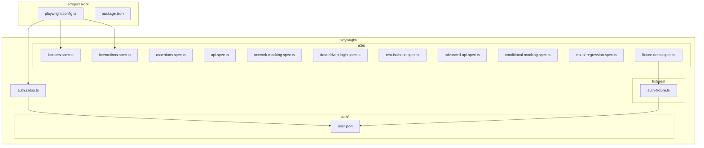

# Design Document: Playwright Test Suite

## Overview

This design defines the architecture, file structure, and implementation approach for a Playwright end-to-end test suite for the Angular Pokedex application. The suite is organized to mirror the Playwright study guide topics, using the existing Pokedex app (login, home, search, route guard) as the vehicle for demonstrating each concept area.

The test suite lives in a `playwright/` directory at the project root — parallel to the existing `cypress/` directory — keeping E2E test tooling separated by framework while sharing the same application under test.

### Key Design Decisions

1. **Directory structure**: All Playwright content lives under `playwright/` (mirroring how Cypress uses `cypress/`). The `playwright.config.ts` stays at the project root alongside `cypress.config.ts`.
2. **Storage state pattern**: Authentication setup runs once as a dependency project, saving session state to `playwright/.auth/user.json`. Subsequent test projects load this state to skip login UI.
3. **Custom fixtures**: A `playwright/fixtures/` directory holds reusable fixture extensions using `base.extend()`.
4. **Network mocking**: Tests use `page.route()` with `route.fulfill()` and `route.continue()` to demonstrate both static and conditional mocking without relying on PokéAPI availability.
5. **Visual regression**: Baselines stored under `playwright/e2e/visual-regression.spec.ts-snapshots/` using Playwright's built-in screenshot comparison.

## Architecture



### Project Structure

```
pokedex/
├── playwright.config.ts          # Playwright configuration (project root)
├── cypress.config.ts             # Existing Cypress configuration
├── package.json                  # Scripts: pw:test, pw:codegen, pw:report
├── playwright/
│   ├── auth.setup.ts             # Authentication setup (login + save storage state)
│   ├── .auth/
│   │   └── user.json             # Saved storage state (gitignored)
│   ├── e2e/
│   │   ├── locators.spec.ts      # Req 2: All locator methods
│   │   ├── interactions.spec.ts  # Req 3: Element interactions
│   │   ├── assertions.spec.ts    # Req 4: Web-first assertions
│   │   ├── api.spec.ts           # Req 5: API testing with request fixture
│   │   ├── network-mocking.spec.ts   # Req 6: Network interception
│   │   ├── data-driven-login.spec.ts # Req 7: Data-driven testing
│   │   ├── test-isolation.spec.ts    # Req 8: Browser context isolation
│   │   ├── fixture-demo.spec.ts      # Req 10: Custom fixtures
│   │   ├── advanced-api.spec.ts      # Req 11: Advanced API handling
│   │   ├── conditional-mocking.spec.ts # Req 12: Conditional mocking
│   │   └── visual-regression.spec.ts   # Req 15: Visual regression
│   └── fixtures/
│       └── auth-fixture.ts       # Custom fixture with base.extend()
├── cypress/                      # Existing Cypress tests (unchanged)
└── src/                          # Angular application source
```

## Components and Interfaces

### 1. Playwright Configuration (`playwright.config.ts`)

The root-level configuration file that defines:

- **baseURL**: `http://localhost:4200` (Angular dev server)
- **testDir**: `'./playwright'` — points to the `playwright/` directory
- **Projects**:
  - `setup` — runs `auth.setup.ts` to create storage state
  - `chromium` — main test project, depends on `setup`, loads storage state
- **Timeouts**: Global timeout of 30 seconds for local E2E
- **Retries**: 1 retry in CI, 0 locally
- **Artifacts**: trace on-first-retry, video on-first-retry, screenshot only-on-failure
- **Output directory**: `./playwright-results/`

```typescript
// playwright.config.ts (simplified structure)
import { defineConfig, devices } from '@playwright/test';

export default defineConfig({
  testDir: './playwright',
  timeout: 30_000,
  retries: process.env.CI ? 1 : 0,
  use: {
    baseURL: 'http://localhost:4200',
    trace: 'on-first-retry',
    video: 'on-first-retry',
    screenshot: 'only-on-failure',
  },
  outputDir: './playwright-results/',
  projects: [
    {
      name: 'setup',
      testMatch: /auth\.setup\.ts/,
    },
    {
      name: 'chromium',
      use: {
        ...devices['Desktop Chrome'],
        storageState: './playwright/.auth/user.json',
      },
      dependencies: ['setup'],
    },
  ],
});
```

### 2. Authentication Setup (`playwright/auth.setup.ts`)

A setup file that:
1. Navigates to `/login`
2. Fills username and password fields
3. Clicks the login button
4. Waits for redirect to `/home`
5. Saves storage state to `playwright/.auth/user.json`

This runs once before the `chromium` project, so all tests start authenticated.

### 3. Custom Fixture (`playwright/fixtures/auth-fixture.ts`)

Demonstrates `base.extend()` pattern:

```typescript
import { test as base } from '@playwright/test';

type AuthFixtures = {
  authenticatedPage: Page;
};

export const test = base.extend<AuthFixtures>({
  authenticatedPage: async ({ browser }, use) => {
    const context = await browser.newContext({
      storageState: './playwright/.auth/user.json',
    });
    const page = await context.newPage();
    await use(page);
    await context.close();
  },
});
```

### 4. Test Spec Files

Each spec file maps to one or more requirements:

| File | Requirements | Purpose |
|------|-------------|---------|
| `locators.spec.ts` | 2 | All locator methods (getByRole, getByLabel, etc.) |
| `interactions.spec.ts` | 3 | Element actions (click, fill, check, hover, etc.) |
| `assertions.spec.ts` | 4 | Web-first assertions (toBeVisible, toHaveURL, etc.) |
| `api.spec.ts` | 5 | API testing with `request` fixture |
| `network-mocking.spec.ts` | 6 | `page.route()` and `route.fulfill()` |
| `data-driven-login.spec.ts` | 7 | Parameterized testing with datasets |
| `test-isolation.spec.ts` | 8 | Browser context isolation |
| `fixture-demo.spec.ts` | 10 | Custom fixtures with `base.extend()` |
| `advanced-api.spec.ts` | 11 | Custom headers, nested JSON parsing |
| `conditional-mocking.spec.ts` | 12 | Conditional route handlers |
| `visual-regression.spec.ts` | 15 | `toHaveScreenshot()` with baselines |

### 5. Package.json Scripts

```json
{
  "pw:test": "npx playwright test",
  "pw:test:ui": "npx playwright test --ui",
  "pw:codegen": "npx playwright codegen http://localhost:4200",
  "pw:report": "npx playwright show-report"
}
```

## Data Models

### Storage State (`playwright/.auth/user.json`)

```typescript
interface StorageState {
  cookies: Array<{
    name: string;
    value: string;
    domain: string;
    path: string;
    expires: number;
    httpOnly: boolean;
    secure: boolean;
    sameSite: 'Strict' | 'Lax' | 'None';
  }>;
  origins: Array<{
    origin: string;
    localStorage: Array<{ name: string; value: string }>;
  }>;
}
```

### Data-Driven Test Dataset

```typescript
interface LoginTestCase {
  description: string;
  username: string;
  password: string;
  shouldSucceed: boolean;
  expectedOutcome: string; // URL or error message text
}

const loginTestCases: LoginTestCase[] = [
  {
    description: 'valid credentials',
    username: 'admin',
    password: 'admin',
    shouldSucceed: true,
    expectedOutcome: '/home',
  },
  {
    description: 'invalid password',
    username: 'admin',
    password: 'wrong',
    shouldSucceed: false,
    expectedOutcome: 'Invalid credentials',
  },
  // ... additional cases
];
```

### Mock Pokemon Response Structure

```typescript
interface MockPokemonResponse {
  name: string;
  id: number;
  sprites: {
    front_default: string;
    back_default: string;
  };
  types: Array<{
    slot: number;
    type: { name: string; url: string };
  }>;
  moves: Array<{
    move: { name: string; url: string };
  }>;
}
```

## Error Handling

### Test-Level Error Handling

- **Network timeouts**: Tests use Playwright's built-in timeout (30s) with auto-retry assertions. No manual waits or sleeps.
- **Authentication failures**: If `auth.setup.ts` fails, the entire `chromium` project is skipped due to the `dependencies` configuration.
- **Flaky selectors**: All locators use user-facing selectors (getByRole, getByLabel, getByTestId) to resist DOM structure changes.
- **API unavailability**: Tests that call PokéAPI directly (Reqs 5, 11) may fail when offline. These are explicitly integration tests. Network mocking tests (Reqs 6, 12) are self-contained.

### Configuration-Level Error Handling

- **Missing storage state**: If `playwright/.auth/user.json` does not exist when the `chromium` project starts, the setup project re-runs first (enforced by `dependencies`).
- **Base URL unreachable**: Tests fail fast with clear error messages if the Angular dev server is not running on port 4200.
- **Visual baseline missing**: First run with `toHaveScreenshot()` creates baselines automatically. CI should have baselines committed.

### Trace and Debugging Artifacts

On test failure:
- Trace zip files saved to `playwright-results/` for Trace Viewer analysis
- Video recordings captured on first retry
- Screenshots taken automatically on failure
- All artifacts available via `npx playwright show-report`

## Testing Strategy

### Approach

This feature IS the test suite — there is no separate application code to test. The "testing strategy" here defines how to validate that the test suite itself is correct and complete.

### Validation Method

1. **Smoke tests (configuration)**: Verify `playwright.config.ts` has correct settings by running `npx playwright test --list` and confirming all test files are discovered in the `playwright/` directory.

2. **Example-based tests (all spec files)**: Each spec file demonstrates specific Playwright APIs. Validation is running the tests against the live Angular app and confirming they pass.

3. **Integration tests (API specs)**: The `api.spec.ts` and `advanced-api.spec.ts` files make real HTTP calls to PokéAPI. These validate external service interaction.

4. **Visual regression tests**: The `visual-regression.spec.ts` establishes baselines on first run and detects UI drift on subsequent runs.

### Why Property-Based Testing Does Not Apply

This feature is a test suite demonstrating Playwright API usage patterns. The acceptance criteria are about:
- Configuration correctness (SMOKE — static checks)
- Demonstrating specific API methods (EXAMPLE — concrete scenarios)
- External API interaction (INTEGRATION — real service calls)
- Documentation presence (not testable)

There are no pure functions with universal properties, no serialization/parsing logic, no data transformations, and no business logic that would benefit from randomized input generation. Each test demonstrates a specific, concrete Playwright capability — running the test itself IS the validation.

### Test Execution

```bash
# Run all Playwright tests
npx playwright test

# Run specific spec file
npx playwright test playwright/e2e/locators.spec.ts

# Run with UI mode for debugging
npx playwright test --ui

# Update visual regression baselines
npx playwright test --update-snapshots

# Generate test scaffolding
npx playwright codegen http://localhost:4200

# View last test report
npx playwright show-report

# Open trace file for debugging
npx playwright show-trace playwright-results/trace.zip
```

### .gitignore Additions

```
# Playwright
playwright/.auth/
playwright-results/
playwright-report/
```
