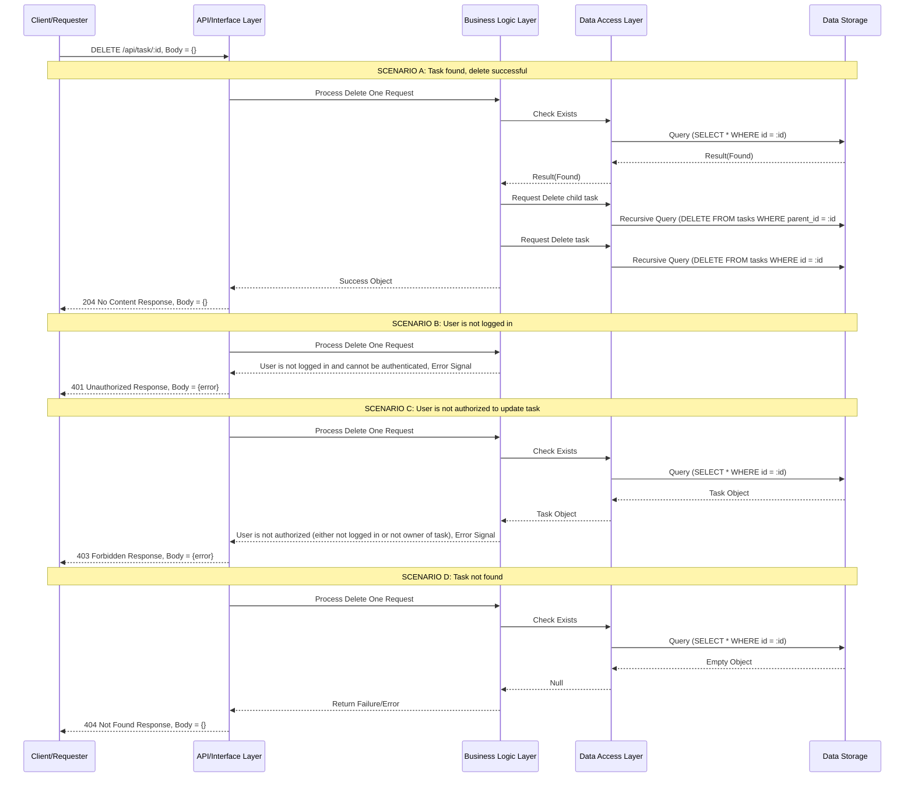

```mermaid
sequenceDiagram
    participant Requester as Client/Requester
    participant API as API/Interface Layer
    participant Logic as Business Logic Layer
    participant DataAccess as Data Access Layer
    participant Storage as Data Storage

    Requester->>API: DELETE /api/task/:id, Body = {}

    Note over Requester,Storage: SCENARIO A: Task found, delete successful
    API->>Logic: Process Delete One Request
    Logic->>DataAccess: Check Exists
    DataAccess->>Storage: Query (SELECT * WHERE id = :id)
    Storage-->>DataAccess: Result(Found)
    DataAccess-->>Logic: Result(Found)
    Logic->>DataAccess: Request Delete child task
    DataAccess->>Storage: Recursive Query (DELETE FROM tasks WHERE parent_id = :id;)
    Logic->>DataAccess: Request Delete task
    DataAccess->>Storage: Recursive Query (DELETE FROM tasks WHERE id = :id;)
    Logic-->>API: Success Object
    API-->>Requester: 204 No Content Response, Body = {}

    Note over Requester,Storage: SCENARIO B: User is not logged in
    API->>Logic: Process Delete One Request
    Logic-->>API: User is not logged in and cannot be authenticated, Error Signal
    API-->>Requester: 401 Unauthorized Response, Body = {error}

    Note over Requester,Storage: SCENARIO C: User is not authorized to update task
    API->>Logic: Process Delete One Request
    Logic->>DataAccess: Check Exists
    DataAccess->>Storage: Query (SELECT * WHERE id = :id)
    Storage-->>DataAccess: Task Object
    DataAccess-->>Logic: Task Object
    Logic-->>API: User is not authorized (either not logged in or not owner of task), Error Signal
    API-->>Requester: 403 Forbidden Response, Body = {error}

    Note over Requester,Storage: SCENARIO D: Task not found
    API->>Logic: Process Delete One Request
    Logic->>DataAccess: Check Exists
    DataAccess->>Storage: Query (SELECT * WHERE id = :id)
    Storage-->>DataAccess: Empty Object
    DataAccess-->>Logic: Null
    Logic-->>API: Return Failure/Error
    API-->>Requester: 404 Not Found Response, Body = {}
```
