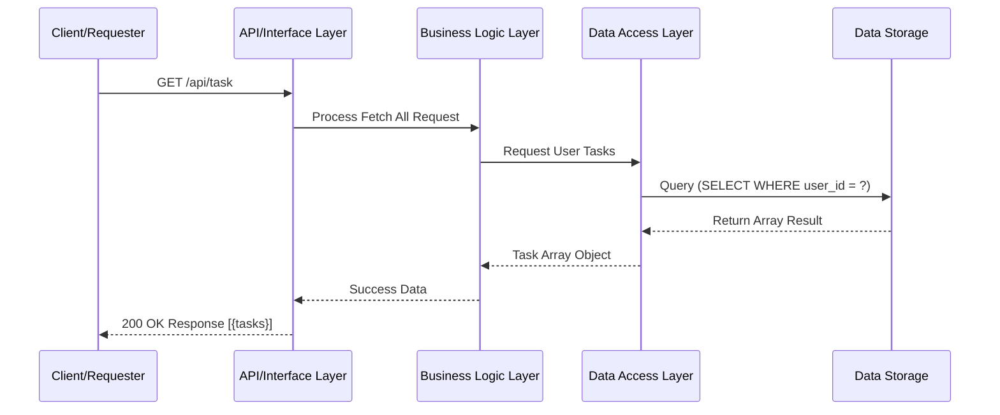

```mermaid
sequenceDiagram
    participant Requester as Client/Requester
    participant API as API/Interface Layer
    participant Logic as Business Logic Layer
    participant DataAccess as Data Access Layer
    participant Storage as Data Storage

    Requester->>API: GET /api/task
    API->>Logic: Process Fetch All Request
    Logic->>DataAccess: Request User Tasks
    DataAccess->>Storage: Query (SELECT WHERE user_id = ?)
    Storage-->>DataAccess: Return Array Result
    DataAccess-->>Logic: Task Array Object
    Logic-->>API: Success Data
    API-->>Requester: 200 OK Response [{tasks}]
```
