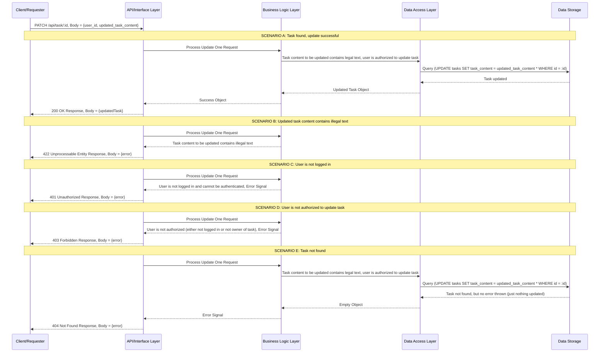

```mermaid
sequenceDiagram
    participant Requester as Client/Requester
    participant API as API/Interface Layer
    participant Logic as Business Logic Layer
    participant DataAccess as Data Access Layer
    participant Storage as Data Storage

    Requester->>API: PATCH /api/task/:id, Body = {user_id, updated_task_content}

    Note over Requester,Storage: SCENARIO A: Task found, update successful
    API->>Logic: Process Update One Request
    Logic->>DataAccess: Task content to be updated contains legal text, user is authorized to update task
    DataAccess->>Storage: Query (UPDATE tasks SET task_content = updated_task_content * WHERE id = :id)
    Storage-->>DataAccess: Task updated
    DataAccess-->>Logic: Updated Task Object
    Logic-->>API: Success Object
    API-->>Requester: 200 OK Response, Body = {updatedTask}

    Note over Requester,Storage: SCENARIO B: Updated task content contains illegal text
    API->>Logic: Process Update One Request
    Logic-->>API: Task content to be updated contains illegal text
    API-->>Requester: 422 Unprocessable Entity Response, Body = {error}

    Note over Requester,Storage: SCENARIO C: User is not logged in
    API->>Logic: Process Update One Request
    Logic-->>API: User is not logged in and cannot be authenticated, Error Signal
    API-->>Requester: 401 Unauthorized Response, Body = {error}

    Note over Requester,Storage: SCENARIO D: User is not authorized to update task
    API->>Logic: Process Update One Request
    Logic-->>API: User is not authorized (either not logged in or not owner of task), Error Signal
    API-->>Requester: 403 Forbidden Response, Body = {error}

    Note over Requester,Storage: SCENARIO E: Task not found
    API->>Logic: Process Update One Request
    Logic->>DataAccess: Task content to be updated contains legal text, user is authorized to update task
    DataAccess->>Storage: Query (UPDATE tasks SET task_content = updated_task_content * WHERE id = :id)
    Storage-->>DataAccess: Task not found, but no error thrown (just nothing updated)
    DataAccess-->>Logic: Empty Object
    Logic-->>API: Error Signal
    API-->>Requester: 404 Not Found Response, Body = {error}
```