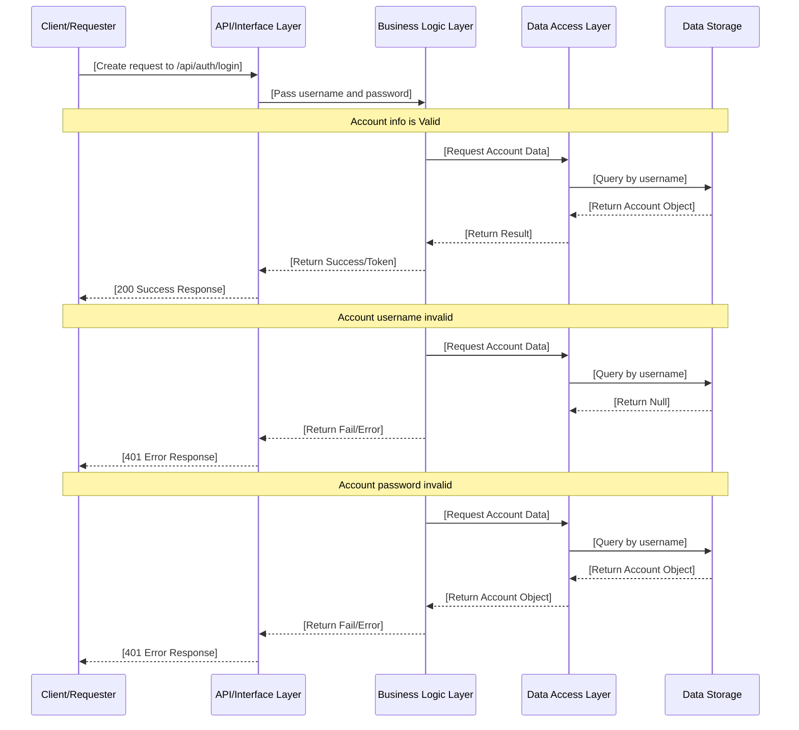

```mermaid
sequenceDiagram
    participant Client as Client/Requester
    participant Controller as API/Interface Layer
    participant Service as Business Logic Layer
    participant Repository as Data Access Layer
    participant Data Storage

    Client->>Controller: [Create request to /api/auth/login]
    Controller->>Service: [Pass username and password]

    Note over Client, Data Storage: Account info is Valid
    Service->>Repository: [Request Account Data]
    Repository->>Data Storage: [Query by username]
    Data Storage-->>Repository: [Return Account Object]
    Repository-->>Service: [Return Result]
    Service-->>Controller: [Return Success/Token]
    Controller-->>Client: [200 Success Response]
    Note over Client, Data Storage: Account username invalid
    Service->>Repository: [Request Account Data]
    Repository->>Data Storage: [Query by username]
    Data Storage-->>Repository: [Return Null]
    Service-->>Controller: [Return Fail/Error]
    Controller-->>Client: [401 Error Response]

    Note over Client, Data Storage: Account password invalid
    Service->>Repository: [Request Account Data]
    Repository->>Data Storage: [Query by username]
    Data Storage-->>Repository: [Return Account Object]
    Repository-->>Service: [Return Account Object]
    Service-->>Controller: [Return Fail/Error]
    Controller-->>Client: [401 Error Response]
```