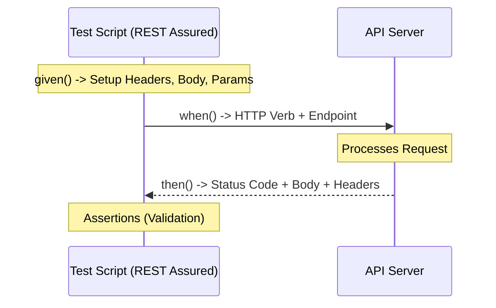

# REST Assured Quick Reference Guide

## Overview of API Automation

In the modern software development lifecycle, the User Interface (UI) is merely a skin over a complex web of interconnected services. To ensure software quality, testing must move "down the stack" to the layer where the actual business logic resides: the **Application Programming Interface (API)**.

### The Role of API Testing in the Testing Pyramid
To design an efficient test suite, one must understand the placement of API tests within the **Testing Pyramid**. While Unit tests focus on isolated logic and UI tests focus on user experience, API tests occupy the critical middle ground.

*   **Integration & System Level:** API tests primarily function at the integration and system levels. They verify that different modules, databases, and third-party services communicate correctly.
*   **The "Sweet Spot" of Automation:** API testing is often more efficient than UI testing because it is:
    *   **Faster:** Executing an HTTP request is orders of magnitude faster than loading a browser and clicking buttons.
    *   **More Stable:** APIs are less prone to "flakiness" caused by UI changes (like a button moving 5 pixels or a loading spinner staying too long).
    *   **Easier to Isolate:** When an API test fails, you know exactly which service or contract is broken, whereas a UI failure could be caused by anything from a network lag to a CSS error.

### Why REST Assured?
REST Assured is a Java-based Domain Specific Language (DSL) designed specifically to simplify the automation of RESTful services. While tools like Postman are excellent for manual exploration, REST Assured is built for **programmatic scale**.

**Key Value Propositions:**
1.  **BDD Syntax:** It utilizes a `given-when-then` structure, making test scripts readable even for non-developers, aligning with Behavior-Driven Development principles.
2.  **Seamless Ecosystem Integration:** Being a Java library, it integrates natively with industry-standard testing frameworks like **JUnit** and **TestNG**, and build tools like **Maven** and **Gradle**.
3.  **Contract Validation:** It excels at validating the "contract" of an API—ensuring that the data types, structures, and status codes strictly adhere to the technical specification.
4.  **CI/CD Readiness:** Because it is code-based, it is easily version-controlled (Git) and can be executed automatically within any Continuous Integration pipeline.

### The API Testing Mindset
Testing APIs requires a shift in focus from **visual correctness** to **data integrity**. An effective API tester focuses on:
*   **The Contract:** Does the response match the expected schema?
*   **The State:** Does a `POST` request actually change the data in the database as expected?
*   **The Boundary:** How does the API react to malformed JSON, missing headers, or unauthorized tokens?
*   **The Protocol:** Are the HTTP status codes (200, 201, 400, 401, 500, etc.) being used correctly to communicate the outcome?

---

## Core Concepts & Terminology

Before writing automation scripts, a tester must understand the mechanics of the HTTP protocol and the structural pattern that REST Assured uses to orchestrate requests.

### The BDD Pattern: Given-When-Then
REST Assured is built upon the **Behavior-Driven Development (BDD)** syntax. This structure is designed to make tests read like human-readable requirements, separating the *setup*, the *action*, and the *validation*.

| Component | Technical Role | Description |
| :--- | :--- | :--- |
| **`given()`** | **Request Specification** | Defines the **preconditions**. This is where you set the state: authentication, headers, query parameters, and the request body. |
| **`when()`** | **The Action** | Defines the **trigger**. This specifies the HTTP method (GET, POST, etc.) and the endpoint (the URL) being targeted. |
| **`then()`** | **Response Validation** | Defines the **assertions**. This is where you inspect the result: status codes, response headers, and the data within the body. |

### The Anatomy of an HTTP Exchange
To effectively configure the `given()` block, one must understand the specific components that make up an HTTP request and response.

#### 1. Request Components (The Input)
When we build a request, we are configuring these primary elements:
*   **Endpoint (URL):** The specific address of the resource (e.g., `https://api.example.com/v1/users`).
*   **HTTP Method (Verb):** The intended action.
    *   `GET`: Retrieve data.
    *   `POST`: Create new data.
    *   `PUT`: Update/Replace existing data.
    *   `PATCH`: Partially update data.
    *   `DELETE`: Remove data.
*   **Headers:** Metadata sent with the request, such as `Content-Type: application/json` or `Authorization: Bearer <token>`.
*   **Parameters:**
    *   **Path Parameters:** Variables embedded in the URL path (e.g., `/users/{id}`).
    *   **Query Parameters:** Key-value pairs appended to the end of the URL for filtering or sorting (e.g., `?page=2&sort=desc`).
*   **Body (Payload):** The actual data being sent to the server, typically formatted as JSON or XML.

#### 2. Response Components (The Output)
Once the request is processed, the server returns a response consisting of:
*   **Status Code:** A three-digit integer indicating the outcome (e.g., `200 OK`, `201 Created`, `400 Bad Request`, `404 Not Found`, `500 Internal Server Error`).
*   **Response Headers:** Metadata about the response (e.g., `Date`, `Server`, `Content-Type`).
*   **Response Body:** The data returned by the server, usually the requested resource or an error message.

### Summary of the Request/Response Flow



---

## Implementation: The Request Specification (`given`)

The `given()` method is the foundation of your test. It is used to construct the **Request Specification**—the complete set of instructions that tells the server exactly what the client wants and how it wants to receive it.

### 1. Parameter Management
Effective testing requires precise control over how data is passed to the endpoint. REST Assured provides specific methods to distinguish between different types of parameters.

#### Path Parameters
Path parameters are used to identify a specific resource within a URL hierarchy. They are placeholders within the endpoint string that are dynamically replaced during execution.
*   **Syntax:** `.pathParam("key", "value")`
*   **Use Case:** Targeting a specific user ID in a RESTful path like `/users/{id}`.

#### Query Parameters
Query parameters are used to filter, sort, or paginate a collection of resources. They are appended to the end of the URL following a `?`.
*   **Syntax:** `.queryParam("key", "value")`
*   **Use Case:** Filtering a list of products: `/products?category=electronics&sort=price_asc`.

#### Header & Cookie Management
Headers and cookies provide essential metadata, such as security credentials or session identifiers.
*   **Headers:** `.header("Name", "Value")` (e.g., `Authorization` or `Content-Type`).
*   **Cookies:** `.cookie("Name", "Value")` (e.g., `JSESSIONID`).

### 2. Payload Construction (The Body)
The `body()` method is used to send data to the server, typically during `POST`, `PUT`, or `PATCH` operations. As a test suite matures, the method of constructing this body should evolve to ensure maintainability.

| Maturity Level | Approach | Implementation Example | Pros/Cons |
| :--- | :--- | :--- | :--- |
| **Level 1: Low** | **Hardcoded Strings** | `.body("{\"name\":\"John\"}")` | **Pros:** Quick to write.<br>**Cons:** Highly brittle, difficult to read, prone to syntax errors. |
| **Level 2: Medium** | **Data Maps** | `.body(new HashMap<String, String>() {{ put("name", "John"); }})` | **Pros:** More dynamic and programmatic.<br>**Cons:** Becomes verbose and messy with deeply nested JSON. |
| **Level 3: High** | **POJOs (Serialization)** | `.body(new User("John", "Doe"))` | **Pros:** Type-safe, reusable, matches professional engineering standards.<br>**Cons:** Requires initial setup of Java classes. |

#### Professional Standard: Serialization with POJOs
In a production-grade framework, we use **Plain Old Java Objects (POJOs)** combined with a serialization library like **Jackson** or **GSON**. Instead of manually building JSON, you create a Java class that represents your data model. REST Assured automatically converts (serializes) this Java object into a JSON string during the request.

**Example Workflow:**
1.  **Define the Model:**
    ```java
    public class User {
        public String name;
        public String email;
        // Constructor, Getters, and Setters
    }
    ```
2.  **Execute the Test:**
    ```java
    User newUser = new User("John Doe", "john@example.com");

    given()
        .contentType(ContentType.JSON)
        .body(newUser) // Automatic Serialization
    when()
        .post("/users")
    ...
    ```

### 3. Authentication Strategies
Security is a core component of API testing. REST Assured provides built-in support for various authentication schemes to ensure your `given()` block includes the necessary credentials.

*   **Basic Authentication:** Uses a username and password.
    *   `.auth().basic("username", "password")`
*   **Bearer Token (OAuth2):** The most common method for modern APIs, involving a long-lived or short-lived string.
    *   `.header("Authorization", "Bearer " + token)`
*   **Preemptive Authentication:** Forces the client to send credentials immediately, rather than waiting for a `401 Unauthorized` challenge from the server.
    *   `.auth().preemptive().basic("user", "pass")`

---

## Implementation: The Action (`when`)

The `when()` method serves as the functional pivot of the BDD structure. It transitions the test from the **state** (the setup provided in `given()`) to the **execution** (the actual network call). 

In REST Assured, the `when()` method is not just a syntactic placeholder; it is the gateway to the various HTTP verbs that define the intent of your request.

### 1. The HTTP Verbs
The method you call immediately following `when()` determines the type of request sent to the server. Selecting the correct verb is essential for both valid API interaction and accurate testing of the application's logic.

| Method | RESTful Intent | Common Success Codes | Typical Use Case |
| :--- | :--- | :--- | :--- |
| **`.get()`** | **Retrieve** | `200 OK` | Fetching a user profile or a list of products. |
| **`.post()`** | **Create** | `201 Created` | Registering a new user or submitting an order. |
| **`.put()`** | **Replace** | `200 OK`, `204 No Content` | Updating an entire user profile (overwriting existing data). |
| **`.patch()`** | **Modify** | `200 OK` | Changing only a single field, like a user's password. |
| **`.delete()`**| **Remove** | `200 OK`, `204 No Content` | Deleting a resource or a specific record. |

### 2. Endpoint Targeting and Dynamic Routing
The `when()` method is where you specify the target **URI (Uniform Resource Identifier)**. In professional automation, we rarely hardcode these strings; instead, we use dynamic routing to make tests reusable.

#### Static vs. Dynamic Endpoints
*   **Static:** The endpoint is a fixed string.
    *   `when().get("/api/v1/health")`
*   **Dynamic (Path Parameters):** The endpoint contains placeholders that are resolved using the values defined in the `given()` block.
    *   `when().get("/api/v1/users/{id}")`
    *   *Note: The `{id}` is a placeholder that REST Assured maps to a `.pathParam("id", value)` defined previously.*

### 3. The Transition to the Response
The `when()` method is the point of no return. Once the verb is invoked, the library executes the network request and produces a **Response Object**. 

Depending on how you structure your code, the result of the `when()` action will lead into one of two paths:

1.  **The Assertion Path (`then()`):** You immediately chain the `.then()` method to perform inline validations (e.g., checking if the status code is 200).
2.  **The Extraction Path (`extract()`):** You use the `.extract()` method to pull data out of the response (like an ID or a Token) so that it can be stored in a variable and used in a subsequent, separate request.

### Implementation Summary

```java
// Example 1: The Assertion Path (Standard BDD)
given()
    .header("Authorization", "Bearer token")
when()
    .get("/users/123")  // The action is triggered here
then()
    .statusCode(200);   // Moves immediately to validation

// Example 2: The Extraction Path (For complex workflows)
String newId = given()
    .contentType(ContentType.JSON)
    .body(newUserObject)
when()
    .post("/users")     // The action is triggered here
then()
    .statusCode(201)
    .extract()
    .path("id");        // The data is captured for later use
```

---

## Implementation: The Validation (`then`)

The `then()` method is the "Judgment Phase" of the test. It is where you assert that the actual response received from the server matches the expected outcome defined in your test requirements. Without a robust `then()` block, a test only proves that a request was sent, not that the system behaved correctly.

### 1. Core Assertions
The most common validations involve checking the "metadata" of the response to ensure the server is communicating correctly.

*   **Status Code Validation:** The most fundamental check. It ensures the request was processed as expected (e.g., `200` for success, `401` for unauthorized, `404` for not found).
    *   `.statusCode(200)`
*   **Header Validation:** Verifies that the server is sending the correct metadata, such as the `Content-Type` or security headers.
    *   `.header("Content-Type", equalTo("application/json"))`
*   **Response Time Validation:** (Optional/Performance-focused) Ensures the API meets latency requirements.
    *   `.time(lessThan(2000L))`

### 2. Response Body Validation (JSON Path)
In modern API testing, the most critical assertions happen within the **Response Body**. REST Assured uses **JSON Path** syntax to navigate through complex, nested JSON structures to find specific values.

#### Navigating the Hierarchy
JSON Path allows you to "drill down" into the data using dot notation.

| Scenario | JSON Path Syntax | Example Logic |
| :--- | :--- | :--- |
| **Flat Field** | `name` | Validates the top-level key "name". |
| **Nested Object** | `user.address.city` | Navigates through `user` $\rightarrow$ `address` $\rightarrow$ `city`. |
| **Array Element** | `items[0].id` | Accesses the `id` of the first element in the `items` array. |
| **Array Collection** | `items.name` | Returns a list of all "name" values within the `items` array. |

#### Integrating Hamcrest Matchers
To make assertions powerful and readable, REST Assured integrates with **Hamcrest Matchers**. Instead of checking if a value "is equal to X," you use expressive logic to check if a value "is greater than X," "contains Y," or "is not null."

**Common Matcher Patterns:**
*   **Equality:** `equalTo("John")`
*   **Existence:** `notNullValue()`
*   **Collection Logic:** `hasItem("expected_value")` or `hasSize(greaterThan(0))`
*   **String Logic:** `containsString("error")` or `startsWith("ABC")`

### 3. Comprehensive Validation Example
This example demonstrates a professional-grade `then()` block that validates multiple layers of a response (Status, Headers, and complex Body logic).

**The Target JSON:**
```json
{
  "id": 501,
  "status": "active",
  "metadata": {
    "version": "2.0",
    "region": "US-East"
  },
  "tags": ["premium", "verified", "new"]
}
```

**The REST Assured Assertion:**
```java
given()
    .pathParam("id", 501)
when()
    .get("/resources/{id}")
then()
    // 1. Validate Metadata
    .statusCode(200)
    .header("Content-Type", containsString("application/json"))
    
    // 2. Validate Simple Fields
    .body("id", equalTo(501))
    .body("status", equalTo("active"))
    
    // 3. Validate Nested Objects
    .body("metadata.version", equalTo("2.0"))
    .body("metadata.region", equalTo("US-East"))
    
    // 4. Validate Arrays & Collections
    .body("tags", hasItem("premium"))            // Does the list contain this?
    .body("tags", hasSize(3))                    // Is the list the right length?
    .body("tags", containsInAnyOrder("verified", "new", "premium")); // Exact match check
```

### Summary of Validation Strategy
| Goal | Focus Area | Method/Technique |
| :--- | :--- | :--- |
| **Protocol Integrity** | Status & Headers | `.statusCode()`, `.header()` |
| **Data Accuracy** | Specific Field Values | `.body("path.to.field", equalTo())` |
| **Business Logic** | Collection/Array State | `.body("array", hasItem())` |
| **Schema Integrity** | Structure & Types | `.body("field", notNullValue())` |

---

## Advanced Configuration & Optimization

In a small script, global configurations are convenient. However, in a professional automation framework designed for scale, parallel execution, and maintainability, "Global State" is a liability. This section covers how to move from basic setups to scalable, optimized configurations.

### 1. Moving Beyond Global Configuration
By default, many developers use `RestAssured.baseURI = "..."`. While simple, this is **not thread-safe**. If you run tests in parallel, one test might overwrite the `baseURI` while another is mid-request, leading to non-deterministic failures.

#### The Professional Alternative: Request & Response Specifications
Instead of setting global variables, use `RequestSpecBuilder` and `ResponseSpecBuilder`. These allow you to create reusable "templates" that are applied to individual requests.

**Request Specification (Reusable Request Templates):**
```java
// Define a reusable specification for all Authenticated API calls
RequestSpecification authSpec = new RequestSpecBuilder()
    .setBaseUri("https://api.example.com")
    .setBasePath("/v1")
    .addHeader("Authorization", "Bearer " + token)
    .setContentType(ContentType.JSON)
    .build();

// Usage in a test
given()
    .spec(authSpec) // Apply the template
    .pathParam("id", 123)
when()
    .get("/users/{id}")
...
```

**Response Specification (Reusable Validation Templates):**
```java
// Define a reusable specification for all successful JSON responses
ResponseSpecification successSpec = new ResponseSpecBuilder()
    .expectStatusCode(200)
    .expectContentType(ContentType.JSON)
    .expectHeader("Server", notNullValue())
    .build();

// Usage in a test
given()
    .spec(authSpec)
when()
    .get("/users/123")
then()
    .spec(successSpec); // Applies all assertions automatically
```

### 2. Strategic Logging & Debugging
Logging is essential for troubleshooting, but logging everything in a CI/CD environment creates "log bloat" and slows down execution. You must be strategic about *what* and *when* you log.

*   **The "All-In" Approach (Local Debugging):**
    Use `.log().all()` during local development to see every detail of the request and response.
    `given().log().all()...`

*   **The "Conditional" Approach (CI/CD Best Practice):**
    In automated pipelines, you only care about logs when a test **fails**. Use `ifValidationFails()` to keep logs clean during successful runs but provide deep visibility during failures.
    ```java
    given()
        .log().ifValidationFails() // Only logs the request if the 'then()' block fails
    when()
        .get("/users/123")
    then()
        .statusCode(200);
    ```

### 3. Performance & Reliability Optimizations

#### Connection Management
For high-volume testing, configuring the underlying HTTP client (Apache HttpClient) can improve performance by managing connection pools and timeouts.

```java
RestAssuredConfig config = RestAssuredConfig.config()
    .connectionConfig(connectionConfig()
        .closeIdleConnectionsAfter(1, TimeUnit.SECONDS)
        .maxConnections(20));

RestAssured.config = config;
```

#### Handling Latency (Timeouts)
API tests should not hang indefinitely. Implementing timeouts ensures that your test suite fails fast if the service is unresponsive.

*   **Connection Timeout:** How long to wait to establish the connection.
*   **Socket Timeout:** How long to wait for data to arrive after the connection is established.

### Summary of Optimization Strategies

| Feature | Basic Approach | Professional Approach | Benefit |
| :--- | :--- | :--- | :--- |
| **Configuration** | Global `RestAssured.baseURI` | `RequestSpecBuilder` | Thread-safety & Parallelism |
| **Logging** | `.log().all()` everywhere | `.log().ifValidationFails()` | Reduced log noise & speed |
| **Validation** | Manual `.statusCode()` in every test | `ResponseSpecBuilder` | DRY (Don't Repeat Yourself) |
| **Data Handling** | Hardcoded JSON Strings | POJO Serialization | Maintainability & Type-safety |