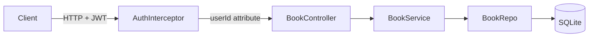

# Design Document: Book Management

## Overview

This design adds full CRUD (Create, Read, Update, Delete) book management to the Summer Reading Tracker. It introduces a `Book` JPA entity, a `BookRepo` Spring Data repository, a `BookService` for validation and business logic, and a `BookController` exposing RESTful endpoints. All book endpoints are protected by the existing `AuthInterceptor` and scoped to the authenticated user via the JWT subject claim.

The design follows the established layered architecture (controller → service → repo → entity) and mirrors conventions already in use: Lombok annotations, constructor injection, `UUID` primary keys, and class-per-file packaging.

## Architecture



**Request Flow:**

1. Client sends request with `Authorization: Bearer <token>` header.
2. `AuthInterceptor` validates the JWT and attaches `userId` and `username` as request attributes.
3. `BookController` extracts `userId` from the request attribute and delegates to `BookService`.
4. `BookService` validates input, enforces ownership rules, and calls `BookRepo` for persistence.
5. `BookRepo` (Spring Data JPA) executes the database operation.

**Key Design Decisions:**

| Decision | Rationale |
|----------|-----------|
| `@ManyToOne` foreign key from Book to User | Enforces referential integrity at the database level; the `userId` column references the User entity. |
| BookService does not depend on UserRepo | The userId is already validated by the AuthInterceptor via the JWT — no need to re-query the User table. |
| Return 404 for "not found" AND "belongs to another user" | Prevents information leakage — an attacker cannot determine whether a book ID exists under a different account. |
| Separate validation in `BookService` (not Bean Validation annotations) | Matches the existing `UserService` pattern; keeps validation logic explicit. |
| Use `PUT` for full-resource update | Simpler semantics — the client always sends the complete book representation. |

## Components and Interfaces

### BookController

**Package:** `com.example.demo.controller`

| Method | HTTP | Path | Description |
|--------|------|------|-------------|
| `createBook` | POST | `/books` | Create a book for the authenticated user |
| `getAllBooks` | GET | `/books` | Retrieve all books belonging to the authenticated user |
| `getBookById` | GET | `/books/{id}` | Retrieve a single book by ID (must belong to user) |
| `updateBook` | PUT | `/books/{id}` | Update an existing book (must belong to user) |
| `deleteBook` | DELETE | `/books/{id}` | Delete a book (must belong to user) |

All methods extract `userId` from `request.getAttribute("userId")` (set by `AuthInterceptor`).

### BookService

**Package:** `com.example.demo.service`

| Method | Parameters | Returns | Throws |
|--------|-----------|---------|--------|
| `createBook(Book, UUID userId)` | Book entity + owner ID | Saved Book with generated ID | Validation exceptions |
| `getAllBooks(UUID userId)` | Owner ID | `List<Book>` | — |
| `getBookById(UUID bookId, UUID userId)` | Book ID + owner ID | `Book` | `BookNotFoundException` |
| `updateBook(UUID bookId, Book, UUID userId)` | Book ID + updated fields + owner ID | Updated Book | `BookNotFoundException`, validation exceptions |
| `deleteBook(UUID bookId, UUID userId)` | Book ID + owner ID | void | `BookNotFoundException` |

**Validation Rules (enforced in service):**

- `title`: non-null, non-blank, 1–255 characters
- `author`: non-null, non-blank, 1–255 characters
- `genre`: nullable, max 100 characters
- `pageCount`: 1–25000 for create, 1–99999 for update
- Ownership: book's `userId` must match the requesting user's ID

### BookRepo

**Package:** `com.example.demo.repo`

```java
@Repository
public interface BookRepo extends JpaRepository<Book, UUID> {
    List<Book> findAllByUserId(UUID userId);
    Optional<Book> findByIdAndUserId(UUID id, UUID userId);
}
```

### Custom Exceptions

**Package:** `com.example.demo.exception`

| Exception | HTTP Status | When |
|-----------|-------------|------|
| `BookNotFoundException` | 404 | Book ID doesn't exist or doesn't belong to user |
| `BookValidationException` | 400 | Input fails validation rules |

## Data Models

### Book Entity

**Package:** `com.example.demo.entity`

```java
@Data
@NoArgsConstructor
@AllArgsConstructor
@Builder
@Entity
@Table(name = "books")
public class Book {
    @Id
    @GeneratedValue(strategy = GenerationType.UUID)
    private UUID id;

    @Column(nullable = false, length = 255)
    private String title;

    @Column(nullable = false, length = 255)
    private String author;

    @Column(length = 100)
    private String genre;

    @Column(nullable = false)
    private int pageCount;

    @ManyToOne(fetch = FetchType.LAZY)
    @JoinColumn(name = "user_id", nullable = false)
    private User user;
}
```

### REST Request/Response Shapes

**Create / Update Request Body:**
```json
{
  "title": "The Great Gatsby",
  "author": "F. Scott Fitzgerald",
  "genre": "Classic Fiction",
  "pageCount": 180
}
```

**Single Book Response (201 / 200):**
```json
{
  "id": "a1b2c3d4-...",
  "title": "The Great Gatsby",
  "author": "F. Scott Fitzgerald",
  "genre": "Classic Fiction",
  "pageCount": 180,
  "userId": "e5f6g7h8-..."
}
```

**List Response (200):**
```json
[
  { "id": "...", "title": "...", "author": "...", "genre": "...", "pageCount": 180, "userId": "..." }
]
```

**Error Response (400 / 404):**
```json
"Error message string"
```

## Correctness Properties

*A property is a characteristic or behavior that should hold true across all valid executions of a system — essentially, a formal statement about what the system should do. Properties serve as the bridge between human-readable specifications and machine-verifiable correctness guarantees.*

### Property 1: Valid creation round-trip

*For any* valid book payload (title 1–255 non-blank chars, author 1–255 non-blank chars, page count 1–25000) and any authenticated user ID, creating the book should return a non-null UUID and the persisted book's `userId` should equal the authenticated user's ID.

**Validates: Requirements 1.1, 1.2, 6.1**

### Property 2: Blank required fields are rejected

*For any* string composed entirely of whitespace (or null), submitting it as the title or author in a book creation or update request should be rejected with a 400 status, and no book should be created or modified.

**Validates: Requirements 1.3, 1.4, 4.5, 4.6**

### Property 3: Out-of-range or oversized fields are rejected on creation

*For any* book creation request where the page count is outside [1, 25000], or the title exceeds 255 characters, or the author exceeds 255 characters, the service should reject the request with a 400 status and no book should be persisted.

**Validates: Requirements 1.5, 1.6**

### Property 4: Ownership scoping — users see only their own books

*For any* set of books distributed across multiple users, when a user retrieves their book list, the returned collection should contain exclusively books whose `userId` matches the requesting user, and its size should equal the number of books that user owns.

**Validates: Requirements 2.1, 7.2**

### Property 5: Cross-user access is indistinguishable from not-found

*For any* book owned by user A and any different user B, when user B attempts to read, update, or delete that book by ID, the response should be HTTP 404 with the same message as when the book ID does not exist at all.

**Validates: Requirements 3.3, 4.3, 5.3**

### Property 6: Out-of-range fields are rejected on update

*For any* book update request where the page count is outside [1, 99999], or the title exceeds 255 characters, or the author exceeds 255 characters, or the title is blank, or the author is blank, the service should reject the request with a 400 status and the existing book should remain unchanged.

**Validates: Requirements 4.4, 4.5, 4.6**

### Property 7: Create-then-read and update-then-read round-trips

*For any* valid book, after creation the book should be retrievable by ID with all fields matching the originally submitted values. After a valid update, re-fetching the book should reflect the updated values exactly.

**Validates: Requirements 3.1, 4.1**

### Property 8: Delete permanence

*For any* book owned by a user, after a successful deletion (204 response), any subsequent attempt to retrieve that book by ID should return 404.

**Validates: Requirements 5.1, 5.4**

### Property 9: Non-existent book ID returns 404

*For any* randomly generated UUID that does not correspond to a stored book, attempting to read, update, or delete it should return HTTP 404.

**Validates: Requirements 3.2, 4.2, 5.2**

### Property 10: Invalid ID format returns 400

*For any* string that is not a valid UUID format, using it as a book identifier in a GET, PUT, or DELETE request should return HTTP 400.

**Validates: Requirements 3.4**

## Error Handling

| Scenario | HTTP Status | Response Body | Handler Location |
|----------|-------------|---------------|------------------|
| Validation failure (blank field, length exceeded, invalid page count) | 400 | Descriptive error message string | `BookController` `@ExceptionHandler(BookValidationException.class)` |
| Invalid UUID path variable format | 400 | "Book identifier is invalid" | `BookController` `@ExceptionHandler(MethodArgumentTypeMismatchException.class)` |
| Book not found or belongs to another user | 404 | "Book not found" | `BookController` `@ExceptionHandler(BookNotFoundException.class)` |
| Missing/invalid JWT | 401 | Error message | `AuthInterceptor` (existing) |
| Database integrity violation | 500 | Generic error message | `BookController` `@ExceptionHandler(DataAccessException.class)` |

**Design Decisions:**

- **Uniform 404 for "not found" and "not owned"**: The service checks both existence and ownership in a single query (`findByIdAndUserId`). If the optional is empty, the response is always 404 — preventing enumeration attacks.
- **Validation errors are specific**: Each field failure returns a message identifying which field failed and why, aiding frontend developer experience.
- **Exception hierarchy**: `BookValidationException` for input issues, `BookNotFoundException` for missing resources. Both are unchecked runtime exceptions.


