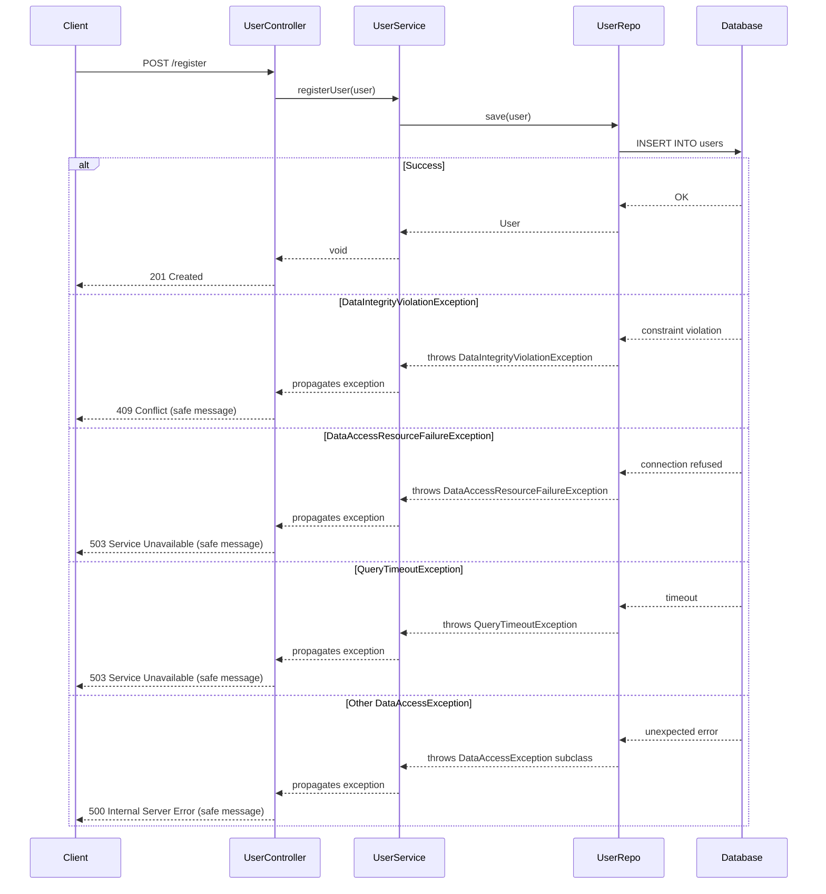

# Design Document: Registration SQL Exception Handling

## Overview

This design adds structured exception handling for Spring Data/JDBC exceptions thrown during the user registration flow. Currently, if `userRepo.save(user)` fails with a database-level exception, Spring Boot's default error handling exposes raw implementation details (class names, SQL, stack traces) in a 500 response.

The solution introduces four `@ExceptionHandler` methods inside `UserController` — one for each known failure mode, plus a catch-all — so that YOUR MAJESTY's users always receive a clean, status-appropriate response while developers get full diagnostics in the logs.

### Design Goals

- **Safety**: Never leak SQL, class names, stack traces, or infrastructure details to the client
- **Specificity**: Map each known failure mode to the most informative HTTP status code
- **Locality**: All handlers live on `UserController` (no global `@ControllerAdvice`), consistent with the existing `RegistrationFailure` handler
- **Non-disruption**: Existing `RegistrationFailure` → 400 handling remains unchanged

## Architecture

### High-Level Flow



### Handler Resolution Strategy

Spring resolves `@ExceptionHandler` methods by finding the **most specific** exception type match. The hierarchy is:

```
DataAccessException (catch-all → 500)
├── DataIntegrityViolationException (→ 409)
├── DataAccessResourceFailureException (→ 503)
└── QueryTimeoutException (→ 503)
```

Because the three specific handlers declare more specific types than the catch-all, Spring will always dispatch to the correct handler without ambiguity. `RegistrationFailure` extends `RuntimeException` (not `DataAccessException`), so it's never in contention with the SQL handlers.

## Components and Interfaces

### UserController (Modified)

Four new `@ExceptionHandler` methods added alongside the existing `handleRegistrationFailure`:

| Method | Exception Type | Status | Response Body |
|--------|--------------|--------|---------------|
| `handleRegistrationFailure` | `RegistrationFailure` | 400 | Exception message (existing) |
| `handleDataIntegrityViolation` | `DataIntegrityViolationException` | 409 | `"Could not complete registration: data conflict"` |
| `handleResourceFailure` | `DataAccessResourceFailureException` | 503 | `"Service temporarily unavailable, please try again later"` |
| `handleQueryTimeout` | `QueryTimeoutException` | 503 | `"Request timed out, please try again later"` |
| `handleGenericDataAccess` | `DataAccessException` | 500 | `"An unexpected error occurred during registration"` |

All new handlers return `ResponseEntity<String>` with `text/plain` content.

### UserService (Unchanged)

No modifications to `UserService`. Database exceptions thrown by `userRepo.save(user)` propagate naturally through the call stack to the controller's `@ExceptionHandler` methods. Spring's default behavior already logs unhandled exceptions, and the controller handlers provide the structured response mapping.

### No New Classes Required

- No new exception classes (we handle Spring's built-in `DataAccessException` hierarchy)
- No `@ControllerAdvice` (handlers stay on `UserController`)
- No new DTOs (responses are plain strings)

## Data Models

No changes to the data model. The `User` entity and `users` table remain as-is:

| Field | Type | Constraints |
|-------|------|-------------|
| `id` | `UUID` | PK, auto-generated |
| `username` | `String` | NOT NULL, UNIQUE |
| `password` | `String` | NOT NULL |

The UNIQUE constraint on `username` is the primary source of `DataIntegrityViolationException` in the registration flow (race condition: two concurrent registrations with the same username pass the service-level `isUnique` check, but one fails at the DB constraint level).

## Error Handling

### Exception-to-Response Mapping

| Exception | HTTP Status | Response Body | Rationale |
|-----------|-------------|---------------|-----------|
| `RegistrationFailure` | 400 Bad Request | Exception message | Business validation error — user's fault |
| `DataIntegrityViolationException` | 409 Conflict | Static safe string | DB constraint race condition — conflict, not user error |
| `DataAccessResourceFailureException` | 503 Service Unavailable | Static safe string | Infrastructure issue — not user's fault, retryable |
| `QueryTimeoutException` | 503 Service Unavailable | Static safe string | Transient issue — retryable |
| `DataAccessException` (other) | 500 Internal Server Error | Static safe string | Unknown DB error — safe fallback |

### Safety Guarantees

Response bodies are **static strings** — they cannot accidentally include dynamic content from exceptions. This is a deliberate design choice over templating the exception message into the response, which would risk leaking internals if the exception message format changes in a future Spring version.

### Transactional Behavior

- `userRepo.save(user)` runs within Spring Data's default transaction scope
- If any `DataAccessException` is thrown, the transaction is rolled back by Spring's infrastructure before the exception propagates
- No partial records are persisted because the exception occurs during the JPA flush/commit phase


