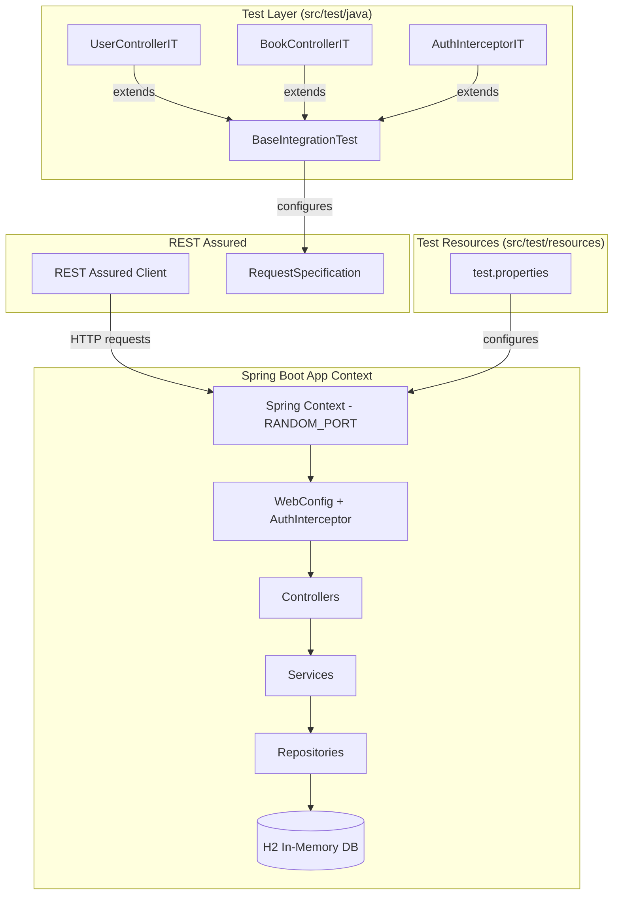
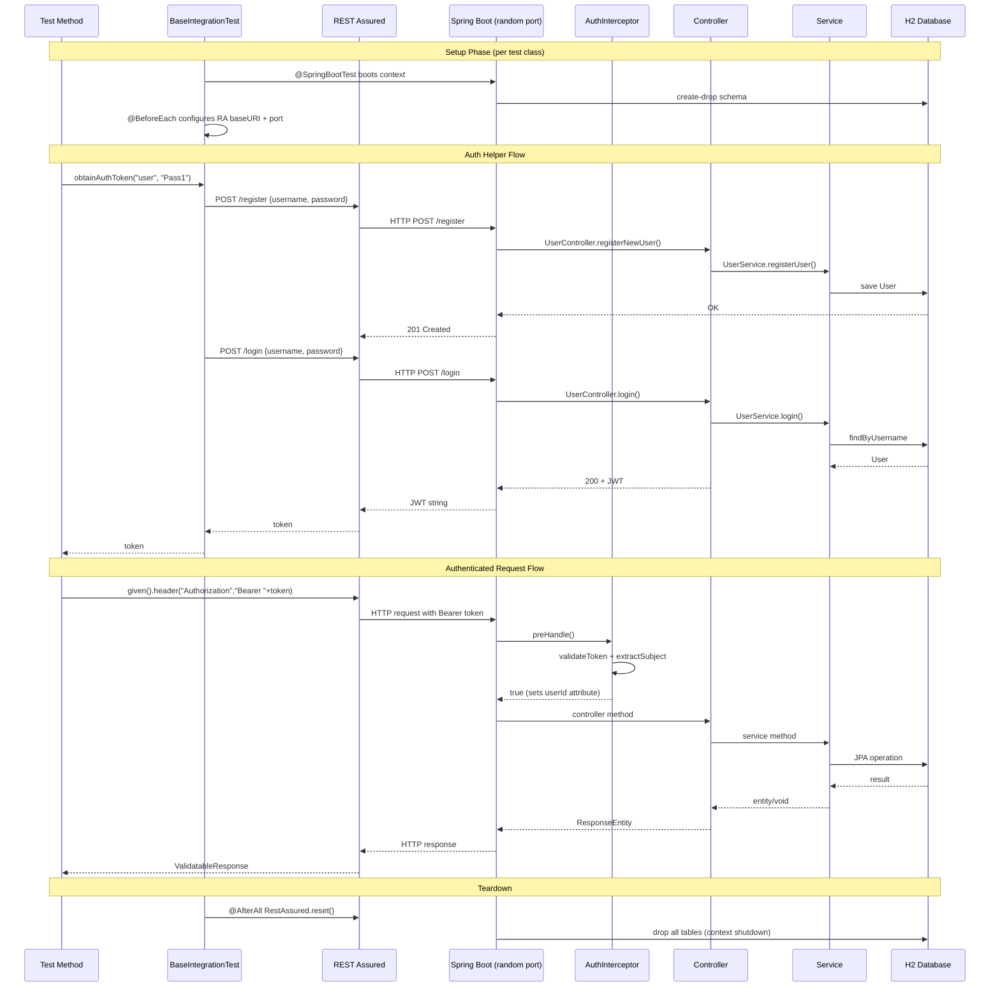

# Design Document: REST Assured Integration

## Overview

This design defines the integration test infrastructure for the Summer Reading Tracker API using REST Assured. The tests exercise the full Spring Boot application context — HTTP routing, JWT authentication, request/response serialization, validation, and H2 database persistence — through REST Assured's fluent BDD-style DSL.

The approach uses `@SpringBootTest(webEnvironment = RANDOM_PORT)` to boot a real embedded server, then sends actual HTTP requests via REST Assured. This catches wiring issues (interceptor registration, exception handlers, Jackson serialization) that unit tests and MockMvc tests would miss.

**Key design decisions:**
- **Full server tests over MockMvc**: While the `rest-assured-spring-mock-mvc` module is included as a dependency for future use, the primary test suite uses real HTTP calls against a random port. This validates the complete request pipeline including the `AuthInterceptor` and CORS configuration.
- **RequestSpecBuilder over global static config**: Each test class builds its own `RequestSpecification` via the base class, avoiding shared mutable state across parallel test execution.
- **H2 create-drop per test class**: Each `@SpringBootTest` context gets a fresh H2 database. The `create-drop` DDL strategy ensures total isolation between test classes.

## Architecture



### Test Execution Flow



## Components and Interfaces

### 1. BaseIntegrationTest (Abstract Class)

**Location:** `src/test/java/com/example/demo/controller/BaseIntegrationTest.java`

**Responsibilities:**
- Annotates with `@SpringBootTest(webEnvironment = RANDOM_PORT)`
- Injects `@LocalServerPort`
- Configures REST Assured `baseURI` and `port` in `@BeforeEach`
- Provides `obtainAuthToken(String username, String password)` helper
- Calls `RestAssured.reset()` in `@AfterAll`

```java
@SpringBootTest(webEnvironment = SpringBootTest.WebEnvironment.RANDOM_PORT)
@TestPropertySource(locations = "classpath:test.properties")
public abstract class BaseIntegrationTest {

    @LocalServerPort
    protected int port;

    @BeforeEach
    void setUp() {
        RestAssured.baseURI = "http://localhost";
        RestAssured.port = port;
    }

    @AfterAll
    static void tearDown() {
        RestAssured.reset();
    }

    protected String obtainAuthToken(String username, String password) {
        // POST /register
        given()
            .contentType(ContentType.JSON)
            .body(Map.of("username", username, "password", password))
        .when()
            .post("/register")
        .then()
            .statusCode(201);

        // POST /login → extract JWT
        return given()
            .contentType(ContentType.JSON)
            .body(Map.of("username", username, "password", password))
        .when()
            .post("/login")
        .then()
            .statusCode(200)
            .extract()
            .body().asString();
    }
}
```

### 2. UserControllerIT

**Location:** `src/test/java/com/example/demo/controller/UserControllerIT.java`

**Extends:** `BaseIntegrationTest`

**Tests:**
- Registration happy path (201)
- Registration with duplicate username (400)
- Registration with null username/password (400)
- Registration with invalid password characters (400)
- Registration with invalid credential length (400)
- Login happy path (200 + valid JWT format)
- Login with wrong password (401)
- Login with non-existent user (401)
- Login with null/missing fields (401)

### 3. BookControllerIT

**Location:** `src/test/java/com/example/demo/controller/BookControllerIT.java`

**Extends:** `BaseIntegrationTest`

**Tests:**
- Create book with valid data (201 + response body validation)
- Create book without auth (401)
- Create book with invalid token (401)
- Create book with missing/blank title (400)
- Create book with invalid pageCount (400)
- Get all books (200 + array)
- Get all books when empty (200 + empty array)
- Get book by ID (200 + fields)
- Get book by non-existent ID (404)
- Get book owned by different user (404)
- Get book with invalid UUID (400)
- Get books without auth (401)
- Update book with valid data (200 + updated fields)
- Update non-existent book (404)
- Update without auth (401)
- Update with invalid data (400)
- Update with invalid UUID (400)
- Delete book (204)
- Verify deleted book is gone (404 on subsequent GET)
- Delete non-existent book (404)
- Delete without auth (401)
- Delete with invalid UUID (400)

### 4. AuthInterceptorIT

**Location:** `src/test/java/com/example/demo/controller/AuthInterceptorIT.java`

**Extends:** `BaseIntegrationTest`

**Tests:**
- Expired JWT → 401
- Malformed Authorization header (no "Bearer " prefix) → 401
- Missing Authorization header → 401
- JWT signed with wrong secret → 401
- Valid JWT → not 401

### 5. Test Properties File

**Location:** `src/test/resources/test.properties`

```properties
spring.datasource.url=jdbc:h2:mem:testdb;DB_CLOSE_DELAY=-1
spring.datasource.driver-class-name=org.h2.Driver
spring.jpa.database-platform=org.hibernate.dialect.H2Dialect
spring.jpa.hibernate.ddl-auto=create-drop
spring.jpa.show-sql=true
spring.jpa.properties.hibernate.format_sql=true
```

## Data Models

### Test Data Strategy

No separate DTOs are needed — the existing `User` and `Book` entities are used directly via JSON maps in REST Assured request bodies. This keeps tests simple and aligned with what a real API client would send.

**Registration/Login request bodies** are simple JSON maps:
```json
{ "username": "TestUser1", "password": "Pass123" }
```

**Book request bodies** are JSON maps:
```json
{
  "title": "The Great Gatsby",
  "author": "F. Scott Fitzgerald",
  "genre": "Fiction",
  "pageCount": 180
}
```

### Data Lifecycle

| Phase | Action | State |
|-------|--------|-------|
| Context start | H2 schema created via `create-drop` | Empty tables |
| `@BeforeEach` / helper methods | Register test users, create test books | Populated for test |
| Test execution | REST Assured sends HTTP requests | Data queried/mutated |
| Context shutdown | H2 tables dropped | Clean slate |

### User Isolation Between Tests

Each test method operates against a shared H2 instance within the same test class. To avoid collisions:
- Each test that needs authentication uses a **unique username** (e.g., appending a counter or UUID segment)
- The `obtainAuthToken` helper handles both registration and login, so tests don't need to pre-seed users manually
- Book tests that verify "no books" scenarios register a fresh user with no books

## Error Handling

### Error Response Mapping

The integration tests validate the following error response structure:

| Scenario | HTTP Status | Response Body Type |
|----------|-------------|-------------------|
| Registration validation failure | 400 Bad Request | Plain text error message |
| Duplicate username | 400 Bad Request | Plain text error message |
| Login failure | 401 Unauthorized | Plain text error message |
| Missing/invalid Bearer token | 401 Unauthorized | Plain text error message |
| Expired/wrong-secret JWT | 401 Unauthorized | Plain text error message |
| Book validation failure | 400 Bad Request | Plain text error message |
| Book not found | 404 Not Found | "Book not found" |
| Invalid UUID path variable | 400 Bad Request | "Book identifier is invalid" |
| Data access error | 500 Internal Server Error | Plain text error message |

### Test Error Handling

Tests themselves should:
- Use `.log().ifValidationFails()` on both request and response specs for CI-friendly debugging
- Not catch exceptions — let assertion failures propagate to JUnit for clear test reports
- Use descriptive test method names that document the expected behavior

## Testing Strategy

### Approach: Example-Based Integration Tests

**Why NOT property-based testing:** This feature involves integration testing of HTTP endpoints with a full Spring application context. The acceptance criteria describe specific request/response scenarios (valid registration, duplicate username, missing token, etc.) rather than universal properties over a wide input space. Each test requires booting the application context and making real HTTP calls — running 100+ iterations would be expensive and wouldn't meaningfully increase coverage beyond well-chosen examples. Integration tests are the appropriate strategy here.

### Test Framework Stack

| Tool | Purpose |
|------|---------|
| JUnit 5 | Test runner and lifecycle |
| Spring Boot Test | Application context management |
| REST Assured 5.5.1 | HTTP client with BDD DSL |
| REST Assured Spring MockMvc | Available for lighter controller-only tests |
| H2 | In-memory database for test isolation |
| Hamcrest | Response body assertions |
| Jackson (via Spring Boot) | JSON serialization of request bodies |

### Dependencies to Add to `build.gradle.kts`

```kotlin
testImplementation("io.rest-assured:rest-assured:5.5.1")
testImplementation("io.rest-assured:spring-mock-mvc:5.5.1")
```

REST Assured 5.5.x supports the Jakarta Servlet namespace (jakarta.servlet.*) required by Spring Boot 3.x+ and uses Jackson for JSON serialization which is already on the classpath via Spring Boot.

### Test Organization

```
src/test/java/com/example/demo/
└── controller/
    ├── BaseIntegrationTest.java      (abstract, shared setup)
    ├── UserControllerIT.java         (registration + login tests)
    ├── BookControllerIT.java         (CRUD tests)
    └── AuthInterceptorIT.java        (security enforcement tests)
src/test/resources/
    └── test.properties               (H2 datasource config)
```

### Naming Convention

- Integration test classes end with `IT` suffix (e.g., `UserControllerIT`)
- Test methods use descriptive names: `register_withValidCredentials_returns201()`
- The naming pattern is `{action}_{condition}_{expectedOutcome}()`

### REST Assured Configuration Strategy

**RequestSpecification via base class setup (not global static):**
- `RestAssured.baseURI` and `RestAssured.port` are set in `@BeforeEach`
- `RestAssured.reset()` is called in `@AfterAll` to clean up
- Each request adds its own headers (Content-Type, Authorization) inline via the `given()` block
- This approach is simpler than `RequestSpecBuilder` for this project's scope while still avoiding repetition through the base class

**Logging:**
- `.log().ifValidationFails()` is used on requests and responses for CI output
- No global logging filters — only log when something goes wrong

### Coverage Map (Requirements → Test Classes)

| Requirement | Test Class |
|-------------|-----------|
| Req 1: REST Assured Dependency | Verified implicitly by all tests compiling and running |
| Req 2: Test Application Context | Verified by `@SpringBootTest` boot in all IT classes |
| Req 3: Base Test Infrastructure | `BaseIntegrationTest` class structure |
| Req 4: Registration Tests | `UserControllerIT` |
| Req 5: Login Tests | `UserControllerIT` |
| Req 6: Book Create Tests | `BookControllerIT` |
| Req 7: Book Read Tests | `BookControllerIT` |
| Req 8: Book Update Tests | `BookControllerIT` |
| Req 9: Book Delete Tests | `BookControllerIT` |
| Req 10: Auth Enforcement Tests | `AuthInterceptorIT` |
