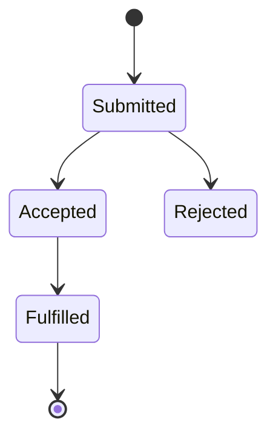

# State Diagram Example

## User Story
Workers can submit their timesheets so they get paid

### Payment Request States
- Submitted
- Accepted
- Rejected
- Fulfilled

```mermaid
stateDiagram-v2
    [*] --> Submitted
    Submitted --> Accepted
    Submitted --> Rejected
    Accepted --> Fulfilled
    Fulfilled --> [*]
```
